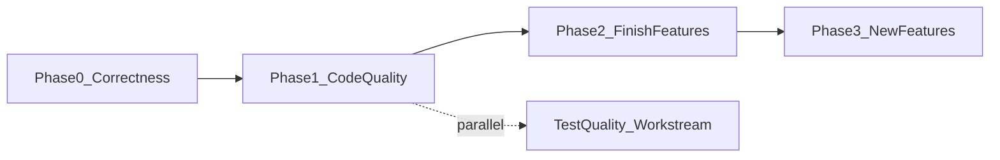

# undatum Improvement Plan (June 2026)

**Status:** Draft for review
**Version analyzed:** 1.1.1 (working tree includes substantial unreleased work)
**Scope:** Features, code quality, and product quality
**Relation to existing plans:** Complements `dev/docs/mirothinker/MIROTHINKER_IMPROVEMENT_ROADMAP.md` and the 37 OpenSpec changes. This plan deliberately avoids re-proposing work that is already implemented or proposed; it focuses on (a) finishing partially-done work, (b) genuine gaps, and (c) quality/hygiene debt that no existing proposal covers.

---

## Executive Summary

undatum is a mature, feature-rich data-wrangling CLI (~50 commands, ~22.7k lines in `undatum/`, ~9.4k lines of tests). Recent development (Phases 1–3, DuckDB acceleration, pipelines, masking, SDK, plugins, Data API) has dramatically expanded the surface, but it has outpaced consolidation:

- **Code quality:** `core.py` is a 2,344-line monolith with 55 command handlers; identical boilerplate (`get_iterable_options`, DuckDB-fallback) is copy-pasted across 30+ command modules; 19 of 45 command modules bypass the `UndatumError` hierarchy; deprecated `IterableData`/`DataWriter` are still imported in 22 modules.
- **Process quality:** CI runs `pytest` only — none of ruff/black/mypy/coverage gates from `make check-all` are enforced. `openspec/specs/` is empty: 37 changes were never archived, several with stale task checklists (`add-diff-command`, `add-extract-command` show 0% tasks but are fully implemented).
- **Product quality:** README documents features that don't exist (`profile` alias, `pipeline templates list/init`), the SDK has placeholder methods (`count()` returns 0, `head()`/`tail()` return `[]`), `undatum/templates/*.yml` likely don't ship in wheels, and there is no release workflow, shell completion, or `--version` flag.
- **Feature gaps vs competitors** (csvkit, miller, qsv, dasel, visidata): no ad-hoc SQL on files, no interactive mode, no shell completion, limited machine-readable output consistency.

The plan is organized into four workstreams and a phased schedule. Phase 0 (correctness and trust) should be done before any new feature work.

---

## Workstream A — Product Correctness & Release Hygiene (Phase 0, highest priority)

These are user-visible defects or trust issues. Cheap to fix, high impact.

### A1. Fix documented-but-missing features
- Register the `profile` command as a `stats` alias in `undatum/core.py` (README already documents it).
- Wire `pipeline templates list` / `pipeline templates init` — the `templates_app` Typer group exists but has zero subcommands; `TemplateManager` (`undatum/cmds/pipeline_templates.py`) is imported but unused.
- Export `Dataset` from `undatum/__init__.py` so `from undatum import Dataset` works as the README claims.

### A2. Fix SDK placeholder methods (`undatum/sdk/dataset.py`)
- `stats()` returns `{}`, `count()` returns `0`, `head()`/`tail()` return `[]` — implement real return values.
- `read(**options)` accepts options but does not pass them to iterators — fix.

### A3. Packaging fixes
- Add `[tool.setuptools.package-data]` so `undatum/templates/*.yml` ship in wheels; relocate or package `examples/recipes/` (the `examples` command resolves them relative to the repo root, which breaks for PyPI installs).
- Remove or minimize legacy `setup.py` (it has no `install_requires` and duplicates metadata).
- Declare missing extras: `plot = ["matplotlib"]`, `s3 = ["boto3"]`, per-database extras (`postgres`, `mysql`); consider moving `elasticsearch`/`pymongo`/`pandas` out of core deps (breaking change — gate behind a minor version bump with clear errors via `DependencyError`).
- Remove unused direct `click` dependency.
- Add a PyPI release workflow (`.github/workflows/release.yml`, trusted publishing on tag).

### A4. Documentation drift
- README: add missing `### mask` and `### api` sections; document `schema_bulk`, `document` alias, `data` entry point, `pip install "undatum[extract]"`; remove `setup.py` build instructions.
- Update `CHANGELOG.md`: the working tree contains a large unreleased feature set (mask, pipeline, templates, examples, plot, db query/load, API, package, extract, plugins, SDK, validation rules, error handling) that is absent from the changelog.
- Fix stale `openspec/project.md` ("no database connections" claim).

### A5. OpenSpec hygiene
- Archive completed changes into `openspec/specs/` (currently empty with 37 active changes).
- Reconcile stale checklists: `add-diff-command` and `add-extract-command` show 0/N tasks but are implemented; `PROPOSAL_STATUS_SUMMARY.md` is outdated.

**Exit criteria:** every README-documented command works; `pip install undatum` from a wheel gives working `examples`/`pipeline templates`; CHANGELOG and OpenSpec reflect reality; releases automated.

---

## Workstream B — Code Quality & Architecture (Phase 1)

### B1. Enforce quality gates in CI
- Extend `.github/workflows/ci.yml` to run `make check-all` equivalent: `black --check`, `ruff`, `mypy`, `pytest --cov` with a coverage threshold (start at current level, ratchet up).
- Add the missing `.pre-commit-config.yaml` (Makefile references it but it doesn't exist).
- Add Python 3.12/3.13 to the CI matrix.

### B2. Extract shared command scaffolding (kills the biggest duplication)
- Create `undatum/common/command_base.py` (or extend `common/`) with:
  - a single `get_iterable_options()` / `ITERABLE_OPTIONS_KEYS` (currently duplicated identically in 33 modules);
  - a `run_with_duckdb_fallback(duckdb_fn, iterable_fn)` helper (the try/except-fallback pattern is duplicated in 9+ modules);
  - a shared open→detect-engine→iterate→write pipeline helper.
- Migrate command modules incrementally; delete the duplicated `normalize_for_json` in `sampler.py`.

### B3. Split `core.py` (2,344 lines, 55 handlers)
- Move sub-app wiring into per-domain CLI modules: `undatum/cli/` with `data_commands.py`, `pipeline_cli.py`, `db_cli.py`, `api_cli.py`, `package_cli.py`, `examples_cli.py`; keep `core.py` as thin assembly.
- Remove import-time side effects: `logging.basicConfig(INFO)` at module import; defer plugin loading cost where possible (startup latency).

### B4. Unify error handling (completes `improve-command-error-handling`)
- Migrate the 19 command modules that still use `logging.error(...); return` (e.g. `searcher`, `analyzer`, `differ`, `doc`, `formatter`, `plotter`, `query`, `sniffer`) to raise `UndatumError` subclasses — silent failures currently exit 0.
- Replace the 14 `sys.exit()` calls in `core.py` (pipeline/db/plot handlers) and those in `validator.py`/`examples.py` with the exception hierarchy so exit codes are consistent with `handle_command_error()`.
- Fix the bare `except:` in `undatum/common/scheme.py` (line ~211).

### B5. Finish the iterabledata migration
- 22 command modules still import deprecated `IterableData`/`DataWriter` from `common/iterable.py`. Complete the migration (tracked but deferred in `migrate-to-iterabledata`) and delete the deprecated classes.

### B6. Decompose god modules
- `cmds/ingester.py` (1,885 lines, 8 ingester classes, 279-line `ingest_single()`): split into `undatum/ingest/` package, one module per backend.
- `cmds/statistics.py` (961 lines; `_stats_duckdb` 187 lines + `_stats_iterable` 174 lines): extract shared metric definitions so the two engines don't drift.
- Remove the ~400 lines of commented-out code concentrated in `statistics.py`, `ingester.py`, `core.py`, `schemer.py`, `ai/providers.py`.

### B7. Typing ratchet
- Only ~29% of `cmds/` modules import `typing`; options are untyped dicts everywhere.
- Introduce a `TypedDict`/`pydantic` model for command options; add type hints module-by-module starting with `common/` and the shared scaffolding from B2; tighten mypy (`disallow_untyped_defs` per-module via overrides) as modules are converted.

### B8. Logging strategy
- One pattern: `logger = logging.getLogger(__name__)` everywhere; user-facing output via `rich.console`, diagnostics via logging; replace raw `print()` in `analyzer.py` (27 uses), `examples.py` (26 uses), etc.

**Exit criteria:** CI enforces format/lint/type/coverage; no module duplicates `get_iterable_options`; all commands raise `UndatumError` subclasses; no deprecated iterable imports; `core.py` < 500 lines.

---

## Workstream C — Test & Quality Engineering (Phase 1–2, parallel to B)

- **Close coverage gaps:** no dedicated tests exist for `plotter`, `analyzer`, `formatter`, `fixlengths`, `exploder`, `filler`, `sniffer`, `transposer` — add them as those modules are touched in B2/B4.
- **Strengthen weak tests:** `test_core.py` has loose assertions (`assert mock_conv.called or result.exit_code != 0`); replace with deterministic CLI tests using `typer.testing.CliRunner` against fixture files.
- **Consolidate fixtures:** many test files duplicate `conftest.py` fixtures locally; centralize.
- **Exit-code contract tests:** once B4 lands, add tests asserting documented exit codes (1/2/3) per error class.
- **DB integration tests:** dockerized PostgreSQL/MySQL/Mongo in a separate optional CI job (recurring open item across ingestion OpenSpec changes).
- **Performance benchmarks:** wire `tests/benchmarks/` into a scheduled CI job with large synthetic datasets to catch DuckDB-path regressions.

---

## Workstream D — Features & Product (Phase 2–3)

### D1. Finish partially-built features (Phase 2 — highest feature ROI)
- **Parallel processing rollout** (`add-parallel-processing`, 3/16 tasks): `common/parallel.py`, `chunked_io.py`, `progress.py` exist but aren't wired into commands. Add `--threads`/`--progress` to convert, ingest, validate, join.
- **S3 everywhere** (`add-s3-connector`, partial): roll `s3://` support out to all path-accepting commands via `common/path_utils.py`, with tests.
- **Plugin connectors/transforms:** registry exists (`plugins/registry.py`) but connectors aren't integrated into the I/O path; finish wiring and document a full packaging example. Make `plugins info` list registered command names (docstring claims it does).
- **Doc command enhancements:** `add-doc-metadata-fields` (0/10) and `improve-doc-markdown-metadata` (0/3) are proposed but untouched.

### D2. New high-value features (Phase 2–3, each needs an OpenSpec proposal)
1. **`undatum sql` — ad-hoc DuckDB SQL over files.** Biggest competitive gap (qsv, dsq, miller all have it); DuckDB infrastructure already in place. Deprecate or reposition the experimental MistQL `query`.
2. **Shell completion + CLI ergonomics:** `undatum --version`, `undatum completion bash|zsh|fish` (Typer supports this), pipx/Homebrew install docs, man pages. (Roadmap item 4.9, never proposed.)
3. **HTML/Markdown profiling reports:** `stats --report report.html` — roadmap §3.2, not implemented; pairs naturally with the existing profiling work.
4. **Consistent machine output:** global `--format json|csv|table` convention for analysis commands (stats, sniff, frequency, headers, diff) for scripting/agents.
5. **Data API hardening:** API-key auth option, S3-backed resources, documented `/docs` OpenAPI page, security model documentation.
6. **Pipeline autodoc:** `pipeline doc` with Mermaid diagrams (roadmap §9.2).
7. **Config file for defaults:** extend `~/.undatum/config.yaml` beyond AI settings (default delimiter, engine, threads, progress, output format).

### D3. Deferred / Phase 3+ (create proposals only when demand is clear)
- GCS (`gs://`) and Azure (`az://`) connectors; Kafka consumption.
- Synthetic data generation (`synth`).
- Interactive TUI (visidata-style) — large effort; validate demand first.
- Interactive plot backends (plotly/bokeh HTML).
- Data drift monitoring / quality dashboards.

---

## Phased Schedule

| Phase | Duration (est.) | Contents | Release |
|-------|-----------------|----------|---------|
| **Phase 0** | 1–2 weeks | Workstream A (A1–A5) | v1.1.2 patch + first automated release |
| **Phase 1** | 4–6 weeks | B1–B5 (CI gates, shared scaffolding, core.py split, error unification, iterable migration) + C started | v1.2.0 |
| **Phase 2** | 4–6 weeks | B6–B8, D1 (parallel, S3, plugins, doc), D2 items 1–4 | v1.3.0 |
| **Phase 3** | ongoing | D2 items 5–7, D3 by demand | v1.4.0+ |

---

## Top 10 Actions (if only ten things get done)

1. Fix README/product drift: `profile` alias, `pipeline templates list/init`, `Dataset` export (A1).
2. Fix SDK placeholders returning fake values (A2).
3. Ship templates/recipes in wheels + add release workflow (A3).
4. Gate CI on lint/format/type/coverage (B1).
5. Extract shared command scaffolding to kill 33-fold duplication (B2).
6. Unify error handling — eliminate silent exit-0 failures (B4).
7. Update CHANGELOG and archive OpenSpec changes (A4–A5).
8. Finish parallel-processing and S3 rollout across commands (D1).
9. Add `undatum sql` (DuckDB SQL over files) (D2.1).
10. Shell completion, `--version`, pipx/Homebrew docs (D2.2).

---

## Risks & Notes

- **Dependency slimming (A3)** is a breaking change for users relying on `pip install undatum` getting Mongo/ES/pandas; communicate via CHANGELOG and clear `DependencyError` messages, target a minor release.
- **core.py split (B3)** touches every command registration — do it after B1 lands so CI catches regressions; keep it mechanical (no behavior change).
- **Error-handling migration (B4)** changes exit codes for previously-silent failures; document in CHANGELOG as a fix.
- **Custom `FileNotFoundError`/`PermissionError` shadow builtins** in `common/errors.py` — keep, but ensure modules never mix them with builtins in the same namespace; consider renaming (`UndatumFileNotFoundError`) in a 2.0.
- All new features in D2/D3 should follow the OpenSpec workflow (`openspec/AGENTS.md`) with a proposal before implementation.
