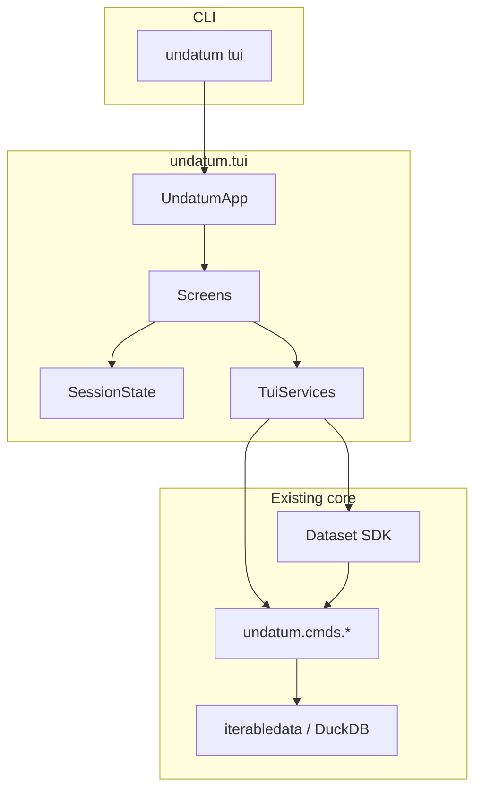

# Design: undatum TUI

## Context

undatum already covers the jobs a TUI would call: streaming I/O (`iterabledata`),
DuckDB-accelerated `stats`/`sql`/`frequency`, Rich tables (`table`), schema/analyze,
validate, convert, and a fluent `Dataset` SDK. What is missing is a **session**: keep
a file open, look at a sample, jump to profile/schema, apply a filter, export the
view — without re-typing flags.

Roadmap sources:

- `dev/docs/mirothinker/MIROTHINKER_IMPROVEMENT_ROADMAP.md` §7.2 (`undatum tui`:
  preview, schema, stats/search).
- `dev/docs/IMPROVEMENT_PLAN_2026-06.md` D3: visidata-style TUI, large effort,
  validate demand first.
- Personas in `docs/SCENARIOS.md`: data analyst (inspect), steward (quality),
  researcher (awkward files). Engineers and agents keep using CLI/SDK/MCP.

Constraints that must not be violated:

- Python **3.9+**.
- Streaming / low memory: never load a multi-GB file into the UI process as a
  full in-memory table.
- Optional extras pattern (`api`, `plot`, `s3`): missing TUI deps raise
  `DependencyError` with `pip install "undatum[tui]"`.
- Command processors in `undatum/cmds/` remain the source of truth.

## Goals / Non-Goals

**Goals**

- Fast first look at a local (and later `s3://`) dataset in a real TTY.
- Preview a **bounded sample**, inspect headers/types, run profile/frequency,
  filter/search, export the current view.
- Show the equivalent `undatum …` command for each action (learnability).
- Reuse existing processors and DuckDB paths; no second engine.
- Testable without a human at a keyboard (service layer + Textual Pilot).

**Non-Goals (explicit)**

- Spreadsheet cell editing, undo stacks, or visidata compatibility.
- Web UI, visual pipeline DAG editor, or embedding a browser.
- Loading entire files into RAM “so scrolling feels native”.
- New format support, Kafka, GCS/Azure, synth, drift dashboards.
- Replacing the CLI, SDK, Data API, or MCP tools.
- Interactive plotly/bokeh inside the terminal (keep `undatum plot` / files).
- Windows-only or GUI-framework (Tk/Qt) ports.

## Personas and jobs

| Persona | Job in the TUI | Not in the TUI |
|---------|----------------|----------------|
| Data analyst | Open file → sample → profile → SQL/filter → save extract | Production pipelines |
| Data steward | Schema + validate summary on a sample; jump to CLI for full validate | CI quality gates |
| Researcher | Sniff-like overview + table of extracted/converted sample | PDF OCR UI |
| Data engineer | Occasional peek; copy echoed CLI into a pipeline YAML | Batch convert of 10k files |
| Agent / MCP | Out of scope (non-TTY) | `undatum mcp`, tools |

## Feature set

### Slice A — Explore (MVP, first implementation)

Entry: `undatum tui [PATH]`.

| Feature | Behavior | Backing code |
|---------|----------|----------------|
| Open dataset | Path argument, or file picker if omitted | `open_iterable` / `open_iterable_with_s3` |
| Sample grid | First *N* rows (default 200, cap configurable, `--limit`) in a scrollable DataTable | `TableFormatter` / iterable take |
| Headers | Field names, inferred types from analyzer/schema sample | `Selector.headers`, `Analyzer` |
| Status bar | Path, format, encoding, row sample size, “not full file” | detect helpers |
| Help overlay | Keybindings | Textual Help |
| Quit | `q` / Ctrl+C restores terminal | Textual |

### Slice B — Profile and search

| Feature | Behavior | Backing code |
|---------|----------|----------------|
| Profile pane | Missingness, distinct, types; JSON/Markdown already exist | `StatProcessor` |
| Frequency | Selected column value counts | `frequency` command |
| Filter | Expression on the **sample** first; optional “apply to file” writes extract | `common.filter` / DuckDB WHERE |
| Search | Substring or expression highlight in grid | existing `search`/`select` |
| Export view | Write current sample or filtered extract to a path | `Converter` / `Dataset.write` |

### Slice C — Query and command palette

| Feature | Behavior | Backing code |
|---------|----------|----------------|
| SQL pane | DuckDB SQL against the file (`data` view), results in grid, `--limit` | `SqlExecutor` |
| Command palette | Fuzzy list of actions; each row shows equivalent CLI | Typer command metadata |
| Command log | History of echoed `undatum …` lines, copyable | in-memory + optional `~/.undatum/tui-history` |

### Slice D — Act (after A–C prove useful)

| Feature | Behavior | Backing code |
|---------|----------|----------------|
| Convert/save as | Choose format/compression, write full file with `--low-memory` | `Converter` |
| Validate summary | Run rules on sample; warn that full-file validate is CLI | `validate` |
| Mask selected fields | Preview on sample, then write | `Masker` |
| Pipeline snippet | Export session (input + last transforms) as YAML step list | `pipeline` spec format |
| Recent files | Last N paths | `~/.undatum/tui-history.json` |

### Out of scope until a later change

- Web UI (`undatum web`).
- In-grid cell edits committed back to the source file.
- Multi-file join designer (use `undatum sql` / CLI).
- Plugin-authored TUI screens (palette can list command plugins later).
- SSH-unfriendly truecolor themes as a requirement (must work in 16-color).

## Architecture

### Principle

The TUI is a **view + session**, not a processor. Every mutating or analytical
action calls the same classes the CLI uses. If a TUI action cannot be expressed
as a CLI invocation, it does not belong in v1.



### Module map (proposed, after approval)

```
undatum/cli/tui_cli.py          # Typer command, DependencyError, TTY check
undatum/tui/__init__.py
undatum/tui/app.py              # textual.App, CSS, bindings
undatum/tui/session.py          # SessionState dataclass
undatum/tui/services.py         # sync adapters around cmds/ (no Textual imports)
undatum/tui/screens/
    browse.py                   # file picker
    preview.py                  # DataTable + headers sidebar
    profile.py                  # stats / frequency
    query.py                    # SQL editor + results
    help.py
undatum/tui/widgets/            # thin wrappers only if needed
tests/test_tui_services.py      # no Textual required
tests/test_tui_app.py           # skip if textual missing; Pilot
```

`services.py` must not import Textual so analysis logic stays unit-testable on
CI images that do not install `[tui]`.

### Session model

```text
SessionState
  source: str                 # path or s3 URI
  options: dict               # encoding, delimiter, format_in, engine
  sample_rows: list[dict]     # bounded; never the full file
  sample_limit: int
  headers: list[str]
  filter_expr: str | None
  last_cli: str | None        # echoed command
  work_dir: Path              # temp extracts (cleaned on exit)
```

Transforms that need a full pass (convert, mask, filtered extract of the whole
file) write to `work_dir` or a user-chosen path via existing command classes,
then optionally reopen the result as a new session. The grid always shows a
sample of the **current source**, not an accumulating in-memory dataframe.

### Data flow: open file

1. Resolve path (`path_utils`, S3 if extra present).
2. Detect format/encoding via existing helpers.
3. Iterate at most `sample_limit` rows (DuckDB `LIMIT` when the engine would
   anyway; otherwise iterable take).
4. Infer headers from the sample + `headers` command if needed.
5. Render DataTable; status bar states sample size vs unknown full count.
6. Count of full file is **opt-in** (`c` key → `Counter.count`), never on open
   for huge files.

### Concurrency

Textual is async; DuckDB/iterable work is blocking.

- Run `TuiServices` methods in `asyncio.to_thread` (or Textual workers).
- One worker at a time per session (cancel/ignore overlapping profile runs).
- Progress: reuse existing progress helpers only if they can write to a Textual
  widget; otherwise a simple “Running stats…” spinner. Do not let `tqdm`/Rich
  progress fight the TUI (disable CLI progress inside services).

### Memory budget

| Operation | Budget |
|-----------|--------|
| Grid sample | Default 200 rows, hard max 5_000 in UI |
| Stats | Existing DuckDB/iterable engines (may scan file; user-initiated) |
| SQL | Require `LIMIT` in UI default (e.g. 500); warn if query has none |
| Export full file | Streaming convert; UI stays on sample until reopen |

## UI structure

### Layout (preview screen)

```
┌ undatum tui  sales.csv  csv  utf-8  sample 200 ──────────────┐
│ Fields          │  name     age  city                         │
│ name            │  Alice    30   New York                     │
│ age             │  Bob      25   London                       │
│ city            │  …                                          │
├─────────────────┴─────────────────────────────────────────────┤
│ / filter  s profile  f freq  : palette  e export  ? help  q   │
│ $ undatum table sales.csv --limit 200                         │
└───────────────────────────────────────────────────────────────┘
```

### Keybindings (v1)

| Key | Action |
|-----|--------|
| `q` | Quit |
| `?` | Help |
| `o` | Open other file |
| `tab` | Cycle panes (fields / grid) |
| `/` | Filter expression |
| `s` | Profile pane |
| `f` | Frequency on selected field |
| `c` | Count full file (opt-in) |
| `e` | Export sample/extract |
| `:` | Command palette |
| `ctrl+s` | SQL pane (slice C) |

Bindings are documented in-app; do not require vim knowledge. Arrow keys and
PageUp/PageDown scroll the grid.

### Command palette

Actions are data, not hardcoded screen classes only:

```python
TuiAction(id, title, cli_template, handler, slice)
# e.g. ("profile", "Profile dataset", "undatum profile {source}", ...)
```

Palette search is substring/fuzzy on `title` and `id`. Selecting an action
updates the command log with the rendered `cli_template`.

## Implementation approach

### Optional extra

```toml
tui = ["textual>=0.80"]
```

Pin the upper bound after checking the last Textual release that supports
Python 3.9. If Textual 2+ requires 3.10, **stay on the 3.9-compatible line**
rather than raising undatum’s floor for one extra.

`undatum tui` without the extra:

```text
Missing dependency: 'textual'
This feature requires 'textual'
Install with: pip install "undatum[tui]"
```

(`DependencyError`, exit 2 — same contract as `api`.)

Non-TTY (piped stdin, CI):

```text
undatum tui needs an interactive terminal. Use undatum table / profile / sql instead.
```

Exit 1 (`ValidationError`).

### CLI surface

```text
undatum tui [PATH]
  --limit INTEGER          Sample rows in the grid (default 200)
  --encoding
  --delimiter
  --format-in
  --engine auto|duckdb|python
```

No `--output` on the entry command; export is an in-app action.

### Reuse rules

| Do | Do not |
|----|--------|
| Call `StatProcessor`, `SqlExecutor`, `Converter`, `Selector`, `Searcher` | Reimplement stats in the widget |
| Pass the same options dicts CLI commands build | Parse Typer options inside Textual |
| Disable progress bars in service calls | Let Rich Live conflict with Textual |
| Echo CLI strings from a single template table | Drift TUI-only flags with no CLI equivalent |

### Theming

Use Textual CSS in `undatum/tui/app.tcss`. Default theme must be readable on
dark and light terminals. No custom font requirements.

## Alternatives considered

| Option | Why not (for v1) |
|--------|------------------|
| **Embed visidata** | Different data model, heavy dep, competing UX, hard to echo undatum CLI |
| **Rich Live + key loop** | Enough for one table, not for multi-screen app; we would reinvent Textual |
| **prompt_toolkit** | Poor table story; no widget CSS; more code |
| **Textual as core dependency** | Punishes headless/CI/agent installs; contradicts extras pattern |
| **Web UI first** | Different security model, not the roadmap’s first step |
| **Full-file pandas in memory** | Violates streaming positioning and #34-class OOM history |

## Testing

- **Services:** pytest on `TuiServices` with `sample_csv_file`; no Textual.
- **App:** `pytest.importorskip("textual")`; `textual.pilot.Pilot` for open →
  grid contains Alice/Bob → quit.
- **CLI:** `CliRunner` `undatum tui` without extra → exit 2; with extra but
  redirected stdin → exit 1.
- Do not run TUI tests in the default install-gate job unless `[tui]` is
  installed; keep the clean-venv smoke on core extras only.

## Security and privacy

- TUI displays file contents on screen; no network unless the source is `s3://`
  or the user runs AI actions (AI **not** in slice A–C).
- Do not log sample rows to disk by default; history stores **paths** only.
- Masking is an explicit slice D action, not automatic.
- Temp extracts in `work_dir` deleted on quit (`finally`, like `PipelineRunner`).

## Migration / packaging

- No breaking CLI changes.
- Document in README after implementation: `pip install "undatum[tui]"` and
  `undatum tui data.csv`.
- Man page: add a `tui` subsection when `make man` is regenerated.
- Single-binary PyInstaller builds: include Textual only if the release extra
  list includes `tui` (default: omit to keep binary size down).

## Risks / Trade-offs

| Risk | Mitigation |
|------|------------|
| Textual drops Python 3.9 | Pin last compatible release; record in `pyproject.toml` |
| Users expect visidata editing | Help text: “explore and export; edit via convert/CLI” |
| Stats on huge files blocks UI | Workers + cancel; status “scanning…”; document `c` is opt-in |
| Duplicate option parsing | Services accept the same dicts as cmds; CLI flags only on `tui` entry |
| CI without a TTY | Pilot tests; skip app tests if import fails |

## Open Questions

Resolved in this design unless implementation proves otherwise:

1. **Library:** Textual (optional extra).
2. **Engine:** reuse cmds/SDK; no TUI-specific DuckDB session beyond `SqlExecutor`.
3. **Sample default:** 200 rows.
4. **Web UI:** separate future change, not a TUI screen.

Still open (do not block architecture approval):

- Exact Textual version pin (verify against Python 3.9 at implementation start).
- Whether slice C SQL lands in the same release as A+B or the next minor.
- History file format (`jsonl` vs `json`).

## Approval gate

Do not add `undatum/tui/` or the `tui` extra until this change is reviewed.
Implementation follows `tasks.md` slices A → B → C; slice D is a follow-on
if A–C are used.
