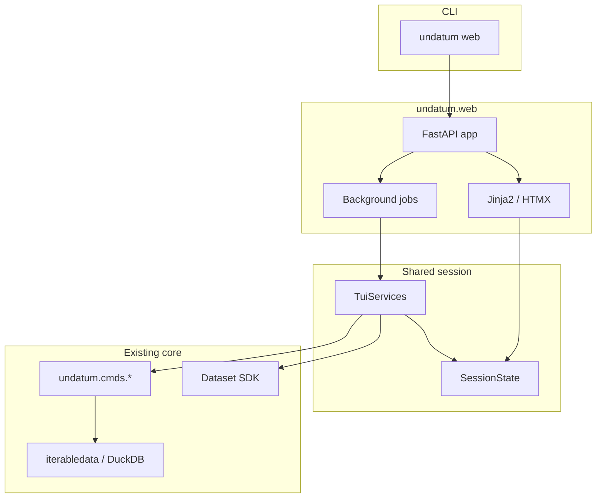

# Design: undatum web UI

## Context

undatum already has three complementary surfaces:

| Surface | Entry | Audience | Role |
| ------- | ----- | -------- | ---- |
| CLI / SDK / MCP | `undatum …`, `Dataset`, tools | Engineers, agents | Source of truth for processing |
| TUI | `undatum tui` | Terminal analysts | Session over a **sample** |
| Data API | `undatum api serve` / `api run` | Apps, scripts | **Read-only** HTTP over configured files |

The missing piece is a **browser session** for people who will not run a TUI:
preview a sample, profile, filter, SQL, export, convert, validate, mask, and
download a pipeline YAML — without loading a multi-GB file into the browser.

Roadmap sources:

- `dev/docs/mirothinker/MIROTHINKER_IMPROVEMENT_ROADMAP.md` §7.2 (web UI after TUI:
  upload or reference data, explore fields/distributions, visual pipelines → YAML).
- TUI change `add-tui-interface`: same “view + session, not a processor” rule;
  `TuiServices` is already Textual-free and maps every action to a CLI string.
- Data API specs: FastAPI + DuckDB, localhost default, optional API key, CORS,
  S3 paths. That product stays read-only and config-driven.

Constraints that must not be violated:

- Python **3.9+**.
- Streaming / low memory: never ship the whole file to the browser as one table.
- Optional extras pattern: missing deps raise `DependencyError` with
  `pip install "undatum[web]"`.
- Command processors in `undatum/cmds/` remain the source of truth.
- Default install and `undatum api` behavior stay unchanged.

## Goals / Non-Goals

**Goals**

- Fast first look at a local (and `s3://`) dataset in a browser on the same machine.
- Preview a **bounded sample**, inspect headers/types, run profile/frequency,
  filter/SQL, export the view, convert/validate/mask, export pipeline YAML.
- Show the equivalent `undatum …` command for each action (learnability).
- Reuse TUI session services and DuckDB/CLI paths; no second engine.
- Testable without a human in a browser (FastAPI `TestClient` + service tests).

**Non-Goals (explicit)**

- Multi-tenant hosted SaaS, accounts, SSO, or sharing datasets on the public internet.
- Turning the Data API into a general-purpose write/mutate HTTP API.
- Spreadsheet cell editing committed back to the source file.
- A Node/React/Vue build pipeline for v1.
- Interactive plotly/bokeh dashboards (keep `undatum plot` / static images).
- Visual drag-and-drop DAG editor in the first slices (YAML export first).
- Replacing the CLI, TUI, SDK, Data API, or MCP tools.
- Loading entire files into RAM or into the browser “so scrolling feels native”.

## Personas and jobs

| Persona | Job in the web UI | Not in the web UI |
| ------- | ----------------- | ----------------- |
| Data analyst | Open/upload → sample → profile → SQL/filter → download extract | Production pipelines |
| Data steward | Schema + validate summary on a sample; copy CLI for full validate | CI quality gates |
| Researcher | Awkward file → table in the browser → convert/export | PDF OCR UI |
| Data engineer | Occasional peek; copy echoed CLI / pipeline YAML | Batch convert of 10k files |
| App developer | Out of scope (use Data API) | `undatum api serve` |
| Agent / MCP | Out of scope | `undatum mcp`, tools |

## Relationship to the Data API and the TUI

```text
                    ┌──────────── cmds / Dataset / DuckDB ────────────┐
                    │                                                 │
  undatum tui  ──►  TuiServices / SessionState  ◄──  undatum web
  (Textual)         (no Textual, no HTML)            (FastAPI+HTMX)
                    │
  undatum api  ──►  DuckDB resource endpoints (read-only, config YAML)
```

- **TUI vs web:** same session model and processors; different view. The web extra
  MUST NOT require `textual`. Implementation may keep importing
  `undatum.tui.services` (that module does not import Textual) or move shared
  types to `undatum/session/` if the naming becomes confusing.
- **Web vs Data API:** different products. Data API exposes stable REST resources
  from a config. The web UI holds **one ephemeral session** (current file, sample,
  filter, last CLI). Do not implement convert/mask as verbs on `/sales`. Optionally
  *link* “open this file in Data API” as a later convenience; v1 does not embed
  `api serve` inside `undatum web`.

## Feature set

### Slice A — Explore (MVP)

Entry: `undatum web [PATH] [--host] [--port] [--limit] [--open]`.

| Feature | Behavior | Backing code |
| ------- | -------- | ------------ |
| Open by path | Form posts a local path or `s3://` URI | `TuiServices.load_sample` / `open_path` |
| Upload | Multipart file streamed to `work_dir`, then opened as a path | temp file + `load_sample` |
| Sample grid | First *N* rows (default 200, cap 5000) as an HTML table | `grid_rows` |
| Headers | Field names and inferred types | `SessionState.headers` |
| Status | Path, format, encoding, sample size, “not full file” | session |
| CLI echo | Last equivalent `undatum …` line, copyable | `last_cli` |
| Quit | Ctrl+C stops uvicorn; `work_dir` deleted | FastAPI lifespan |

### Slice B — Profile and search

| Feature | Behavior | Backing |
| ------- | -------- | ------- |
| Profile | Stats on the **source file**; progress disabled; result table | `StatProcessor` via `TuiServices.profile` |
| Frequency | Counts on selected column of the **sample** | `get_iterable_fields_freq` |
| Filter | Expression on the sample; empty clears | `match_filter` |
| Export view | Write visible sample through convert/write | `Dataset.write` |

Long-running profile: run in a worker thread / background task; UI shows
“Running undatum profile…” and polls or waits. Do not let Rich/tqdm fight the
HTTP server (already disabled in TUI services).

### Slice C — Query and actions

| Feature | Behavior | Backing |
| ------- | -------- | ------- |
| SQL | DuckDB SQL, view `data`, default LIMIT 500, fetch cap 5000 | `SqlExecutor.fetch` / `ensure_sql_limit` |
| Action list | Buttons/forms from the `TuiAction` table (title + CLI template) | `undatum.tui.actions` |
| Recent files | Paths only in `~/.undatum/tui-history.json` (reuse TUI history) | `undatum.tui.history` |

### Slice D — Act

| Feature | Behavior | Backing |
| ------- | -------- | ------- |
| Convert / save as | Full file, `--low-memory`, download or write path | `Converter` |
| Validate sample | Rules on sample; warn full-file is CLI | `ValidationRuleSet` |
| Mask | Preview on sample; optional write via `Masker` | `mask_value` / `Masker` |
| Pipeline YAML | Session → YAML download (`steps` + `$step` chaining) | `build_pipeline_spec` |

### Follow-on (separate change; not v1)

- Visual pipeline DAG that still **exports** the same YAML (does not execute a
  second engine).
- Serving `undatum plot` PNGs inline; plotly/bokeh remains deferred.
- Embedding or generating a Data API config from the current session.
- Multi-file join designer (use `undatum sql` / CLI).

## Architecture

### Principle

The web UI is a **view + session**, not a processor. Every analytical or mutating
action calls the same classes the CLI and TUI use. If an action cannot be expressed
as a CLI invocation, it does not belong in v1.



### Module map (proposed, after approval)

```
undatum/cli/web_cli.py          # Typer command, DependencyError, bind flags
undatum/web/__init__.py
undatum/web/deps.py             # require_web_dependencies()
undatum/web/app.py              # FastAPI factory, lifespan, CSRF, static
undatum/web/routes.py           # HTTP handlers → TuiServices
undatum/web/templates/          # Jinja2 (explore, profile, sql, …)
undatum/web/static/             # CSS; optional small HTMX bundle
tests/test_web_app.py           # TestClient; skip if fastapi missing
tests/test_web_services.py      # reuse TUI service tests where possible
```

`undatum/web/` may import `undatum.tui.services`, `session`, `actions`, and
`history`, but MUST NOT import `undatum.tui.app` or `undatum.tui.screens`.

### Session model

Reuse `SessionState` as-is:

```text
source, options, sample_rows, sample_limit, headers, field_types,
filter_expr, last_cli, format_name, encoding, truncated
```

v1 process = **one session**. Opening another file replaces it. Uploads land in
`work_dir` (temp), recorded as `source`, deleted on shutdown (`finally`, like
pipeline temp files).

The browser never holds `sample_rows` beyond the HTML table of the current
sample (≤ 5000 rows). Full-file work stays on the server.

### HTTP surface (session API, not Data API)

Internal routes for the UI. Document in OpenAPI as “local web session”.

| Method | Path | Effect |
| ------ | ---- | ------ |
| GET | `/` | Explore page (empty or current session) |
| POST | `/open` | Open path or `s3://` |
| POST | `/upload` | Stream upload to `work_dir`, then open |
| POST | `/filter` | Set/clear sample filter |
| POST | `/profile` | Start/show profile |
| POST | `/frequency` | Frequency for a field |
| POST | `/sql` | Run SQL with default LIMIT |
| POST | `/export` | Write current view to a path or download |
| POST | `/convert` | Full-file convert (background) |
| POST | `/validate` | Sample validate |
| POST | `/mask` | Preview or write |
| POST | `/pipeline` | Download YAML |
| GET | `/healthz` | Liveness (no file contents) |

CSRF: cookie + form token (or SameSite strict cookies on localhost). JSON
clients of this app are not a v1 goal.

### Frontend

**Decision: FastAPI + Jinja2 + HTMX (no Node).**

- Python 3.9, extra-sized like `api`, no frontend CI toolchain.
- Forms and tables map 1:1 to service methods.
- HTMX partials refresh the grid/status/CLI line without a SPA.
- Small CSS in-repo; readable on light and dark browsers; no webfont requirement.

Alternatives rejected for v1: React/Vite SPA (build + two languages);
Streamlit/Gradio (wrong abstraction, hard to echo CLI); serving only
`/docs` from the Data API (no session, no convert/mask).

### Concurrency and jobs

Uvicorn is async; DuckDB/iterable work is blocking.

- Slice A open/filter: `asyncio.to_thread` around `TuiServices`.
- Profile/convert/mask-write: one job at a time per process (reject or queue
  overlapping convert). Poll a simple in-memory job record; no Redis.
- Disable CLI progress bars inside services (already done for TUI).

### Memory budget

| Operation | Budget |
| --------- | ------ |
| Grid sample | Default 200 rows, hard max 5_000 in HTML |
| Upload | Stream to disk; default max size documented (e.g. 512 MiB); prefer path/`s3://` for larger |
| Stats | Existing engines (may scan file; user-initiated) |
| SQL | Default LIMIT 500; fetch cap 5_000 |
| Convert | Streaming / `--low-memory`; UI stays on sample until reopen |

## CLI surface

```text
undatum web [PATH]
  --host 127.0.0.1
  --port 8765
  --limit INTEGER          Sample rows in the grid (default 200, max 5000)
  --encoding --delimiter --format-in --engine
  --open / --no-open       Open the system browser (default: open on TTY)
  --api-key                Optional shared secret (or UNDATUM_API_KEY)
```

Missing extra:

```text
Missing dependency: 'fastapi'
This feature requires 'fastapi'
Install with: pip install "undatum[web]"
```

(`DependencyError`, exit 2.)

Binding `0.0.0.0` is allowed but MUST print a warning that this is a local
session tool, not a hardened public app.

`undatum web` is excluded from pipeline commands (same as `tui`).

## Security and privacy

- Default bind **127.0.0.1**. This is a local assistant, not a data portal.
- Optional API key (`X-API-Key` / cookie) using the same env var as the Data API
  when the operator wants a shared secret on a trusted network.
- Uploaded bytes go to `work_dir` only; deleted on shutdown. Do not log sample
  rows. History stores **paths** only (reuse TUI history file).
- Path open: same trust model as the CLI (user can open any readable path they
  type). No directory listing of the whole disk in v1; a path field + recent
  files is enough.
- CSRF on POST. No CORS wildcard. `--cors-origins` is a Data API concern; the
  web UI is same-origin.
- Masking is an explicit action, not automatic.
- Do not expose convert/mask on the public Data API as a side effect of this
  change.

## Testing

- **Services:** existing `tests/test_tui_services.py` remain the processor tests.
- **App:** `pytest.importorskip("fastapi")`; `TestClient` for `/` → open fixture
  CSV → table contains Alice/Bob → CLI line contains `undatum table`.
- **CLI:** `CliRunner` `undatum web` without extra → exit 2.
- Do not require Playwright in the default CI job. Optional browser tests later,
  skip if missing.
- Install-gate job stays on core extras; `[web]` is optional like `[tui]` / `[api]`.

## Packaging

```toml
web = ["fastapi", "uvicorn", "jinja2", "python-multipart", "httpx"]
```

`httpx` matches the `api` extra (TestClient). The `web` extra does **not** include
`textual`. Operators who already have `[api]` still need Jinja2/multipart for the UI.

Single-binary builds: omit the web extra by default (HTML templates + uvicorn
size). Document `undatum web` in README and the man page only after Slice A works.

## Alternatives considered

| Option | Why not (for v1) |
| ------ | ---------------- |
| **Extend `api serve` with `/ui`** | Mixes a stable read-only API with an ephemeral mutating session; wrong auth/CORS story |
| **Streamlit / Gradio / Panel** | Heavy, hard to echo CLI, weak streaming story, extra runtime personality |
| **React SPA + Data API only** | Cannot convert/mask without inventing a write API; Node toolchain |
| **Reuse TUI in the browser (textual-web)** | Experimental, still a terminal, does not meet “less technical user” |
| **Full-file pandas in the browser** | Violates streaming positioning |

## Risks / Trade-offs

| Risk | Mitigation |
| ---- | ---------- |
| Users bind `0.0.0.0` and leak files | Default localhost; warning; optional API key; docs |
| Large uploads fill disk | Size cap; stream to temp; prefer path open; cleanup on exit |
| Duplicate session logic vs TUI | Call `TuiServices`; extract `undatum.session` only if imports get messy |
| HTMX feels “not modern” | Acceptable for a CLI companion; SPA can be a later extra |
| Profile blocks the event loop | `to_thread` / one background job |

## Open Questions

Resolved in this design unless implementation proves otherwise:

> 1. **Library:** FastAPI + Jinja2 + HTMX, optional `undatum[web]`.
> 2. **Engine:** reuse TUI services / cmds / SDK; no web-specific DuckDB session
>    beyond `SqlExecutor`.
> 3. **Sample default:** 200 rows, max 5_000 (same as TUI).
> 4. **Data API:** remains a separate read-only product.
> 5. **Visual DAG:** follow-on change, YAML-compatible.

Still open (do not block architecture approval):

- Exact default port (8765 vs 8000 vs ephemeral).
- Whether `--open` defaults on or off in CI/non-TTY (recommend off when stdout
  is not a TTY, on otherwise).
- Whether to extract `undatum/session/` in the first implementation PR or import
  `undatum.tui.services` until a second consumer proves the rename.

## Approval gate

Do not add `undatum/web/` or the `web` extra until this change is reviewed.
Implementation follows `tasks.md` slices A → B → C → D; visual pipeline DAG and
plotly remain separate changes.
